# Overview of PyCity School District Analysis

Maria, the PyCity School District chief data scientist is tasked with compiling and analyzing funding and testing data for all 15 of the high schools in her district. As Maria was finishing up her analysis, it comes to the District's attention that the test results of 9th grade at Thomas High School (THS) is suspect and needs to be removed from the analysis.

Below is a summary of the updated results and an impact analysis of removing the Thomas High School 9th grade results. 

## Resources

Utilizing Python and the powerful, open-source library, Pandas, Maria was able to merge 2 data set to compile for analysis: 

* **Student data:** containing details of the students including their reading and math scores from the latest standardized test (**students_complete.csv**). 

* **School Data:**  containing school-specific data, including school size and annual budget. 

**Items to note:**  

1. While examining the data Maria noticed several errors in the **student_name** field in the **students_complete.csv** file; specifically, the inclusion of inappropriate prefixes (i.e. Mr., Mrs., Ms., Miss, Dr.) and suffixes (i.e. MD, DDS, PhD, DVM).  The data was cleaned to restore affected names.

2. In order to eliminate the results of the 9th grade class at Thomas High School, the values were converted to a NaN value and the number of students was removed from the aggregate calculations.  That is to say, when looking at the school-wide performance, these 461 scores were completely eliminated, NOT given a score of 0, as that would skew the results significantly and inappropriately.

3. A "passing" test score is 70% or higher for both math and reading; "overall passing" is achieved when BOTH math and reading scores are 70% or higher.
 

## Results
 
At the **District Level**, you will notice that **prior to the removal** of the Thomas High School 9th grade test scores the percentage of **Overall Passing** for the district is **65.2%**.
 
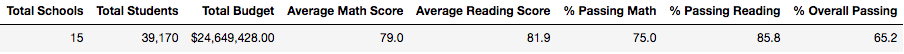

Once removed and adjusted, the District results **drop slighly to 64.9%**.  In fact, all but the Average Reading score dropped when rounding to the nearest tenth of a point.

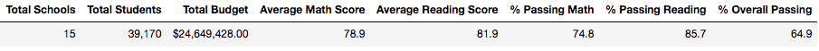

Drilling down into the **School level**, we can see why.  Prior to the removal of the THS 9th grade scores, Thomas High School was ranked #2 in the **top 5 schools** based on percentage of Overall Passing.  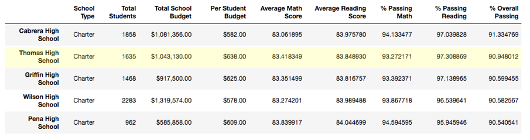

Without the 9th grade performance, Thomas High School is still ranked second in the top five for overall passing percentage; although it is clear that the 9th graders did draw up their average scores, but eliminating them did little to change their overall school-level standing as the averages decline without their contribution.   
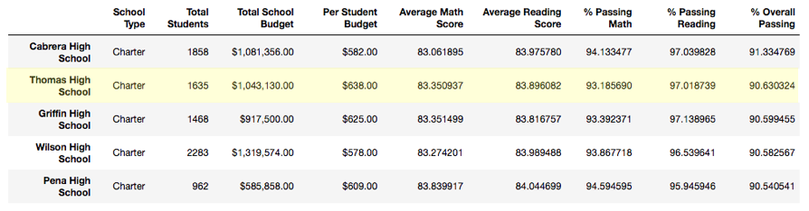

*Please note: the results are being displayed with several decimal places to underscore the mathematical impact.*

While the individual math and reading results and their respective percentages are lower than the #3 ranked school, Griffin High School, the percentage of Thomas High School 10-12 grade students that passed both math and reading is still higher than the percentage of 9th - 12th grade Griffin students that passed both tests.  

Not surprising, the adjustment in THS data did not have an effect on the **bottom 5 schools**:
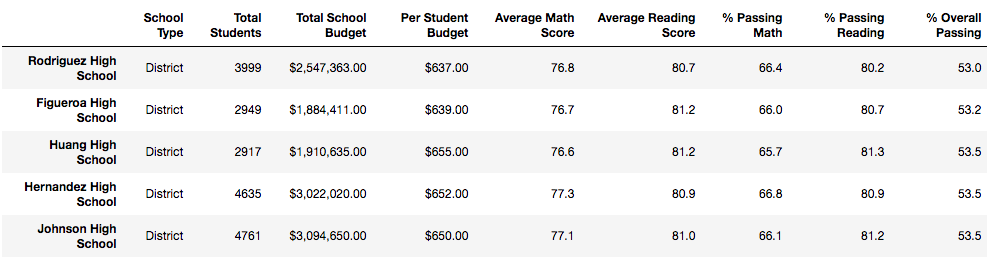

Drilling one more level down to **grade level**, it is consistent that the removal of the Thomas High School 9th-grade scores from the District-level data did make the over District-wide 9th-grade results lower, but not significantly:

Prior to Thomas High School adjustment:
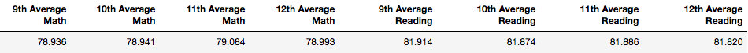

After Thomas High School adjustment:
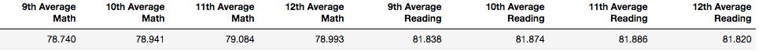

**School Size**:  
The removal of the 9th graders' results from Thomas High School does not change the actual size of the school.  Even if the 461 9th graders were removed from the total school size, Thomas High School would still be included in the "Medium (1000 - 2000)" category with a new student total of 1,174 students.  

The results of performance based on school size is not affected when rounding to the nearest tenth of a point.
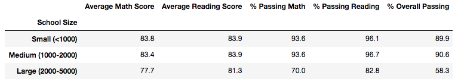

**School Spend**:     
Similarly, the removal of the 9th grader scores does not change the school's budget nor the spend per student.  It has an insignificant effect on the performance based on dollars spent per student when rounding to the nearest tenth of a point.
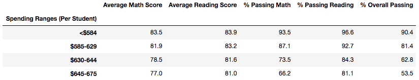

**School Type**:  
When looking at School Type (District vs. Charter), again the removal of the THS 9th-grade results does not impact the finding that the Charter school type significantly outperforms the District school type. 

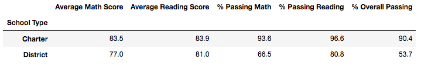

What is interesting is while the overall passing performance is on average 36% higher in the Charter schools, the average score of the reading and math are not as far off.  
	
## Summary of Findings 

By removing the Thomas High School 9th-grade results for math and reading had the following effect:

1. The **average math score** for Thomas High School decreased by **0.07 points**.
2. The **average reading score** for Thomas High School decreased by **0.15 points**.
3.  The **overall passing percentage** for Thomas High School decreased by **0.31% points**. 
4.  The average **Math** score for **district-wide 9th-grade** decreased by **0.196 points**. 
5.  The average **Reading** score for the **district-wide 9th-grade** decreased by **0.076 points**.

It is no surprise that the Thomas High School 9th-grade scores had little impact on the overall District analysis because the scores were not out of line from other similar schools in the District; that is, not out of line from what you would expect from the 9th graders at THS.  

This is evident by looking at the descriptive statistics of THS vs all the other Charter schools.  The reading scores are actually lower by 0.07 points; and math results are an average of 0.54 points higher.      
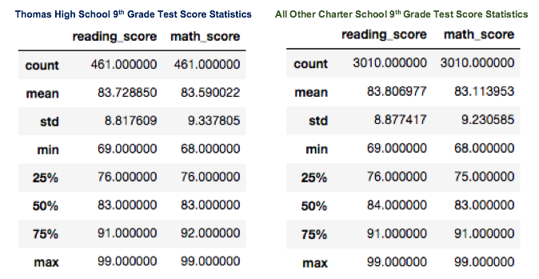

Finally, the number of test scores eliminated from the overall analysis represents only 1.2% of all tests scores (461 out of 39,170). Low impact on variance from the mean and low impact as a percetage of the total results in a low impact on District-wide results.  

Here are some findings regardless of the Thomas High School 9th-grade scores (*please refer to the all school summary below*):   
 
1.  The students of PyCity School District tend to **perform better on reading tests** than Math; and a higher percentage of students earn a passing grade on Reading.  

2.  **Charter Schools perform better than District Schools** on the standardized math and reading tests and had a higher overall passing percentage. In fact, all the top 5 schools were all Charter and all the bottom 5 were District. Even more telling, is the fact ALL of the Charter-type schools (Rank 1 through 8) outperformed ALL of the District-type schools (Rank 9 through 15). 

3.  **More budget dollars per student does not determine test performance**. In fact, we see an inverse relationship; the fewer budget dollars per student the higher their scores and percent of students passing. However, it is not clear what portion of the budget dollars per student is going towards curriculum versus non-cirrculuum expenses (i.e. facilities), or what additional, outside funding made be contributing to the curriculum to contradict this relationship.  
 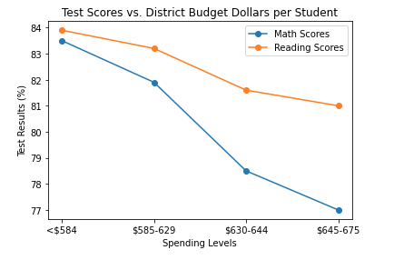

4. **Schools with 2,000 or Fewer students** seem to perform better on these standardized tests than the larger schools. Only 1 of the 8 schools with an enrollment of more than 2,000 students is in the top 50% of schools; and that school is a Charter-type school!

**All School Summary Rankings:**
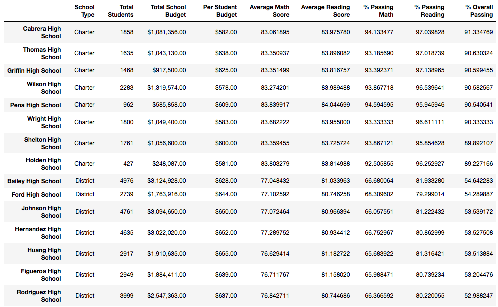
